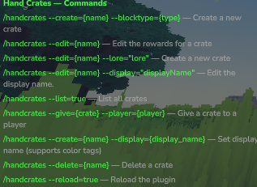
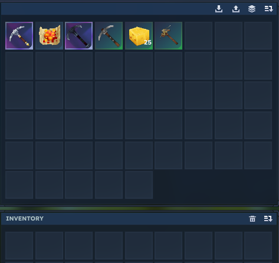
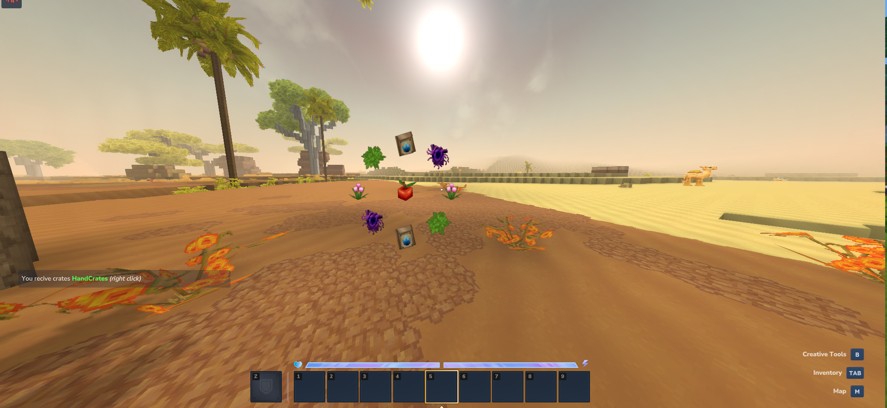

# Hand Crates

Turn any block into a customizable physical crate for your Hytale server — create, fill, and hand out reward crates entirely in-game.
******
******

## Features

- Create a crate from any in-game block type
- In-game GUI editor to fill crate rewards (drag & drop items)
- Custom display name and lore with color tag support
- Give crates directly to players via command
- List, edit, delete crates anytime
- Hot reload — no server restart needed

******


## Example: Creating a Custom Crate

```
# Create Custom Crates Reward
/handcrates --create=Dungeon --blocktype=Furniture_Desert_Chest_Small

# Give Custom Crates Reward Item
/handcrates --give=Dungeon --player=kliTi2000

# Set Item Name Display
/handcrates --edit=Dungeon --display="<red> Vote <bold> Key </bold> </red>"

# Set Lore Example
/handcrates --edit=Dungeon --lore="<green> This Crates give you reward of doungeon </green>"

# Set Reward (opens in-game GUI editor)
/handcrates --edit=Dungeon
```



### Open Animations
******

## All Commands

| Command | Description |
|---|---|
| `/handcrates --create={name} --blocktype={type}` | Create a new crate |
| `/handcrates --edit={name}` | Open the reward editor GUI |
| `/handcrates --edit={name} --lore="..."` | Set crate lore |
| `/handcrates --edit={name} --display="..."` | Set crate display name |
| `/handcrates --give={name} --player={player}` | Give a crate to a player |
| `/handcrates --list=true` | List all crates |
| `/handcrates --delete={name}` | Delete a crate |
| `/handcrates --reload=true` | Reload the plugin |

## Configurable Messages

You can customize the plugin's messages by editing the `config.json` file:

| Key | Default value | Placeholder |
|---|---|---|
| `open` | `You open the chest {crates}` | `{crates}` → crate name |
| `give` | `You give crates {crates}` | `{crates}` → crate name |
| `recive` | `You recive crates {crates}` | `{crates}` → crate name |
| `inventory_full` | `<red> Your inventory not have amount space. </red>` | — |


## Installation

1. Drop the `.jar` into your server's `mods/` folder
2. Restart the server
3. Run `/handcrates --list=true` to confirm it's loaded

## Permissions

---
Hytale server with operator/admin or `handcrates.admin` permissions to manage commands.
---

*Feedback and feature requests welcome via the project page.*